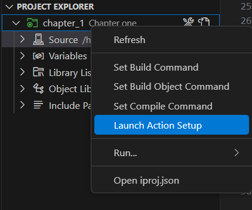

# Chapter one

## Hello world

Remember that RPG is a procedural language and its modern syntax is similar to C but it does not use brackets `{}`. Our first program is a [simple hello world](./ch1_qrpglesrc/hello1.pgm.rpgle).

Let's go line by line of the simple hello world program. 

[First line](./ch1_qrpglesrc/hello1.pgm.rpgle#L1) of this code is `**Free`, which tells the RPG compiler that the source code is fully free (not half columnar and half free. Fully modern code for winners). 

[Line 5](./ch1_qrpglesrc/hello1.pgm.rpgle#L5) `Ctl-opt DftActGrp(*no) main(main)` is the compilation specification for this program defined by the `Ctl-opt` keyword. `DftActGrp(*no)` means that this program should not be **activated** in the default **activation** group which is where the legacy **OPM** programs were **activated** and `main(main)` defines which procedure is the main procedure of this program, this is similar to **C** `main` function. Defining a main procedure in the compilation specifications excludes the use of the famous **RPG Cycle**. If you want to see a modern example that still uses the **RPG Cycle** check [hello2](./ch1_qrpglesrc/hello2.pgm.rpgle)

[Line 7](./ch1_qrpglesrc/hello1.pgm.rpgle#L7) defines the procedure **main** with the keyword `Dcl-proc` and `end-proc` along with an interface `Dcl-pi *n int end-pi` that specifies what parameters this procedure accepts and returns. In this case it receives nothing and returns nothing. 

[Line 11](./ch1_qrpglesrc/hello1.pgm.rpgle#L11) does a simple screen display (which is actually a **joblog** write that you can check with `dspjoblog`)

> More about program **activation** and **execution** at [The IBM intro repo: Program execution](https://github.com/kraudy/ibmi_os?tab=readme-ov-file#program-execution).

[Line 13](./ch1_qrpglesrc/hello1.pgm.rpgle#L11) does a simple screen display (which is actually a **joblog** write that you can check with `dspjoblog`)

## Compilation

Go to your project and set the deploy location

Do the **Launch action setup**

Select **RPG** and **ok**

Set up your pub400 library

After that go to the [simple hello world](./ch1_qrpglesrc/hello1.pgm.rpgle), hit **Ctrl + e** and select **Create RPGLE Program**

## Run it

do the display from a procedure `do_hello` 

put the `do_hello` on a module and bunrn it on the pgm

put the `do_hello` on a module and then on a srvpgm

an **int**, 0 for non-error and >0 for any error like the Linux style (this is a preference of mine because you can just do an **if** check on a procedure call to check if an error occurred)