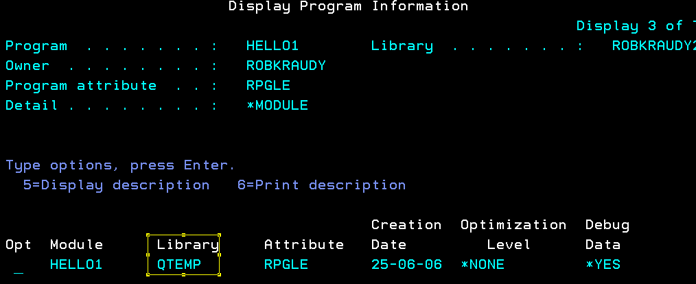
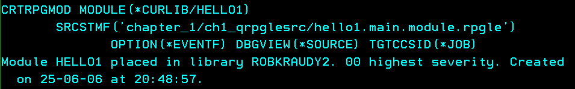
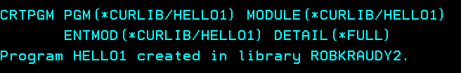
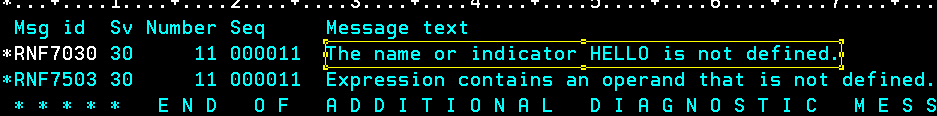
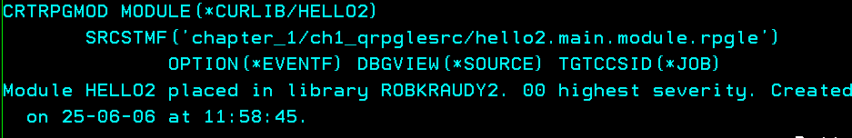
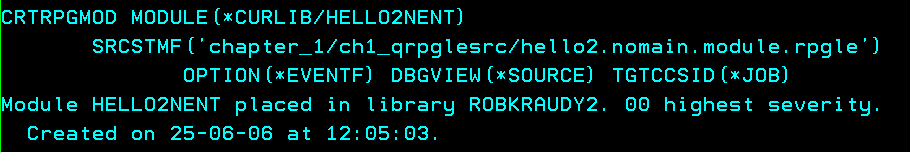
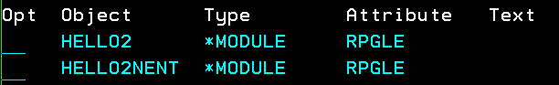
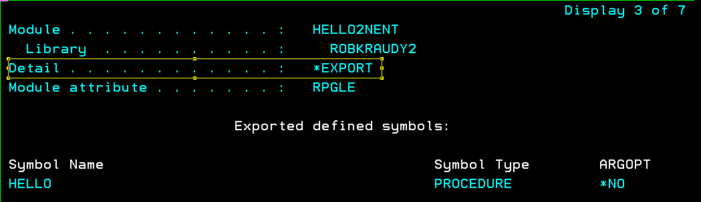
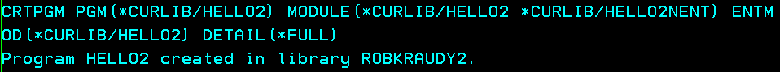

# Chapter one: Programs and Modules


## Hello world

Remember that RPG is a procedural language and its modern syntax is similar to C but it does not use brackets `{}`. Our first program is a [simple hello world](./ch1_qrpglesrc/hello1.pgm.rpgle).

```js
**Free
///
// Moder RPG Hello world
///
Ctl-opt DftActGrp(*no) main(main);

Dcl-proc main;
  Dcl-pi *n;
  end-pi;

  dsply 'Hello world!';

  return;

End-proc;
```

Let's go line by line of the simple hello world program. 

[First line](./ch1_qrpglesrc/hello1.pgm.rpgle#L1) of this code is `**Free`, which tells the RPG compiler that the source code is fully free (not half columnar and half free. Fully modern code for winners). 

[Line 5](./ch1_qrpglesrc/hello1.pgm.rpgle#L5) `Ctl-opt DftActGrp(*no) main(main)` is the compilation specification for this program defined by the `Ctl-opt` keyword. `DftActGrp(*no)` means that this program should not be **activated** or **loaded** in the default **activation group** or **job memory space** which is where the legacy **OPM** programs were **activated**.

`main(main)` defines which procedure is the main **entry point** of this program, this is similar to **C** `main` function. Defining a main procedure like this in the compilation specifications excludes the use of the famous **RPG Cycle**. If you want to see a modern example that still uses the **RPG Cycle** check [hello1.cycle](./ch1_qrpglesrc/hello1.cycle.pgm.rpgle)

[Line 7](./ch1_qrpglesrc/hello1.pgm.rpgle#L7) defines the procedure **main** with the keyword `Dcl-proc` and `end-proc` along with an interface `Dcl-pi *n int end-pi` that specifies what parameters this procedure accepts and returns. In this case it receives nothing and returns nothing. 

[Line 11](./ch1_qrpglesrc/hello1.pgm.rpgle#L11) does a simple screen display (which is actually a **joblog** write that you can check with `dspjoblog`)

> More about program **activation** and **execution** at [The IBM intro repo: Program execution](https://github.com/kraudy/ibmi_os?tab=readme-ov-file#program-execution).

[Line 13](./ch1_qrpglesrc/hello1.pgm.rpgle#L11) does a simple screen display (which is actually a **joblog** write that you can check with `dspjoblog`)

## Compilation

At this point you should have done the [project setup](../README.md#set-up) and be connected to PUB400.

Go to the [simple hello world](./ch1_qrpglesrc/hello1.pgm.rpgle) file, hit **Ctrl + e** and select **Create RPGLE Program**. This is the straigth up way of compiling a bind RPG program.

<div style="text-align: center;">
  
</div>

Select **compare** as deploy method.

<div style="text-align: center;">
  
</div>

It should compile normally and show and output like this

<div style="text-align: center;">
  
</div>

Log into PUB400 and go to your library with `wrklibpdm YourLibrary` + **OP 12**. 

>More about [IBM I navigation here](https://github.com/kraudy/ibmi_os?tab=readme-ov-file#facing-the-ibm-i)

<div style="text-align: center;">
  
</div>

There should be the compiled **Hello1** program

<div style="text-align: center;">
  
</div>

## Run it

To run it do **OP 16** on the object

<div style="text-align: center;">
  
</div>

Here is the output

<div style="text-align: center;">
  
</div>

You can also do `dspjoblog` + `F10` + `Shift F6` to see the output

<div style="text-align: center;">
  
</div>

<div style="text-align: center;">
  
</div>

Look at that, when you do **OP 16** on **PDM** the os actually executes the command `CALL PGM(ROBKRAUDY2/HELLO1)`. Lets try it.

<div style="text-align: center;">
  
</div>

The same output

<div style="text-align: center;">
  
</div>

In the same way, when compilation is done directly from VsCode, the OS also executes a command to compile the source code.

<div style="text-align: center;">
  
</div>

Expand the command input space doing a `call qcmd`
<div style="text-align: center;">
  
</div>

Similar to the `CALL`, compilation can be executed manually. The full qualified path `/home/YourUser/builds/rpg_language/chapter_1/ch1_qrpglesrc/hello1.main.module.rpgle` may be too long, so, change the working directory with `CHGCURDIR DIR('/home/YourUser/builds/rpg_language')`.
<div style="text-align: center;">
  
</div>

Make sure you have the rigth cur lib with `chgcurlib` which will be placed in the `*CURLIB` parameter.
<div style="text-align: center;">
  
</div>

```js
CRTBNDRPG PGM(*CURLIB/hello1) 
SRCSTMF('chapter_1/ch1_qrpglesrc/hello1.pgm.rpgle') 
OPTION(*EVENTF) DBGVIEW(*SOURCE) TGTCCSID(*JOB)
```

Paste it and press **F4** if alignment is needed for the path

<div style="text-align: center;">
  
</div>

Program created

<div style="text-align: center;">
  
</div>

Remember the compilation output that VsCode showed with the **Ctrl + e** compilation? Well, that is called a **spool file**. To check the spool of the previous compilation do a `wrksplf` 

> A Spool File is like a report that was intended to be printed and read by programmers in the old times. Hence the format.

<div style="text-align: center;">
  
</div>

Do **OP 5** on the hello1 spool file

<div style="text-align: center;">
  
</div>

Magic! Here is the same output that the VsCode compilation gave us

<div style="text-align: center;">
  
</div>

## Entry Module

The previous compilation actually creates an object **Module** and deletes it when the **Pgm** object is created. **OP 5** + `enter` + `enter` on the previous `hello1` program will show the module was created in the **QTEMP** library, which is a temporary library where everthing is deleted when you log off.

<div style="text-align: center;">
  
</div>

So, a **Pgm** is compose of at least 1 module that has a **program entry**. Lets do it manually with some more IBM I **CL (Control Language)** commands.

> **Program entry** or **entry point** means that it is the point where the OS can transfer execution control to the program.

Note that the module by itself does not have an activation group. This is because a module is not **activated** directly or *loaded* like a program. 

> More about program execution here: [IBM i: Program Execution](https://github.com/kraudy/ibmi_os?tab=readme-ov-file#program-execution)

Compiling the [simple hello world](./ch1_qrpglesrc/hello1.pgm.rpgle) as a module with a **program entry**

```js
CRTRPGMOD MODULE(*CURLIB/HELLO1) 
SRCSTMF('chapter_1/ch1_qrpglesrc/hello1.pgm.rpgle') 
OPTION(*EVENTF) DBGVIEW(*SOURCE) TGTCCSID(*JOB)
```

<div style="text-align: center;">
  
</div>

Compilation failed, this makes sence since an **Module** can't be executed directly by the OS, so, you can't specify an **activation group** `DftActGrp` `ActGrp` for the module, that is done for the program.

Now, removing the activation specifications and compiling again with [simple hello module](./ch1_qrpglesrc/hello1.main.module.rpgle.rpgle)
```js
CRTRPGMOD MODULE(*CURLIB/HELLO1) 
SRCSTMF('chapter_1/ch1_qrpglesrc/hello1.main.module.rpgle') 
OPTION(*EVENTF) DBGVIEW(*SOURCE) TGTCCSID(*JOB)
```

<div style="text-align: center;">
  
</div>

Success, lets create the program from the compiled module and specify that it is also the module that has the **entry point**

```js
CRTPGM PGM(*CURLIB/HELLO1) MODULE(*CURLIB/HELLO1)
ENTMOD(*CURLIB/HELLO1) DETAIL(*FULL)
```

<div style="text-align: center;">
  
</div>

- `ENTMOD(*CURLIB/HELLO1)` indicates which module has an **entry point** or **main procedure**, also, the program activation group is taken from the module type (RPG, CL, etc) and is set to `QILE`
- `DETAIL(*FULL)` gives the full details of the program compilation in the spool.`wrksplf` + **OP 5** shows all the system's procedures referenced by the compiled object

Do **OP 5** on the HELLO1 program, there is the activation group
<div style="text-align: center;">
  
</div>

Press `enter` + `enter` times and there it is, the compiled module which is inside the program and is not in **QTEMP**, is in our library.
<div style="text-align: center;">
  
</div>

> The `HELLO1` module can be deleted and the `HELLO1` program would execute normally since it has a copy of the compiled module inside.

## NoMain Module

A module usually has a procedure that is the **entry point** of execution, also called **the main procedure** and all the other procedures are **no main** which means, they can't be executed directly but can be part of the execution stack initiated by the **main procedure**. 

There are also modules that don't have a **main procedure** or an **entry point**, these are the [**NoMain Modules**](./ch1_qrpglesrc/hello1.nomain.module.rpglerpgle) and can't be used directly to create a program object.

Modules are the base for the modern ILE procedure driven modular approach. A program can have 1 or more modules but only one of them is the **entry module** with an **entry poin**. 

The bad thing of creating programs like this is that the compiled modules is kept inside the program, so, if you change the module's logic, the module need to be re-compiled and every program that uses it needs to be re-compiled too. For that reason, there is something called **Service Programs** but more on that later. Ok, moving along.

Compile it the same way as the **main module**
```js
CRTRPGMOD MODULE(*CURLIB/HELLO1) 
SRCSTMF('chapter_1/ch1_qrpglesrc/hello1.nomain.module.rpgle') 
OPTION(*EVENTF) DBGVIEW(*SOURCE) TGTCCSID(*JOB)
```

Now, try creating the program from the module
```js
CRTPGM PGM(*CURLIB/HELLO1) MODULE(*CURLIB/HELLO1)
ENTMOD(*CURLIB/HELLO1) DETAIL(*FULL)
```

Uoh, an error
<div style="text-align: center;">
  
</div>

`dspjoblog` + **F10** shows the error
<div style="text-align: center;">
  
</div>

Makes sense since we are telling the OS with `ENTMOD(*CURLIB/HELLO1)` that the module has an **entry point** and it does not.

Lets make some changes to the modules and compile them again

```js
CRTRPGMOD MODULE(*CURLIB/HELLO2) 
SRCSTMF('chapter_1/ch1_qrpglesrc/hello2.main.noproto.module.rpgle') 
OPTION(*EVENTF) DBGVIEW(*SOURCE) TGTCCSID(*JOB)
```

This should be an error since we are calling the procedure `hello()` and it is not defined inside the module, the compiler raises a not defined exception

<div style="text-align: center;">
  
</div>

We need to tell the compiler that this procedure is not in the same module and describe the interface to call it. For that, we need the procedure **prototype**. 

The `hello` procedure of [hello2.nomain.module.rpgle](./ch1_qrpglesrc/hello2.nomain.module.rpgle) is very simple, it takes no parameters and also returns none. So the prototypes should be like this.

```js
Dcl-pr hello extproc;
End-pr;
```

Try again with the prototype.
```js
CRTRPGMOD MODULE(*CURLIB/HELLO2) 
SRCSTMF('chapter_1/ch1_qrpglesrc/hello2.main.module.rpgle') 
OPTION(*EVENTF) DBGVIEW(*SOURCE) TGTCCSID(*JOB)
```

<div style="text-align: center;">
  
</div>


Nice! it compiled. Now lets try compiling the nomain module

```js
CRTRPGMOD MODULE(*CURLIB/HELLO2NENT) 
SRCSTMF('chapter_1/ch1_qrpglesrc/hello2.nomain.module.rpgle') 
OPTION(*EVENTF) DBGVIEW(*SOURCE) TGTCCSID(*JOB)
```

<div style="text-align: center;">
  
</div>

<div style="text-align: center;">
  
</div>

There we have them both!. Here is an important thing, noticed the [**export**](./ch1_qrpglesrc/hello2.nomain.module.rpgle#L7) next to the `hello` procdure? Well, that tells the compiler that this procedure must be exposed to be accesed from outside the module and it will be match agains the `hello` prototype we defined [**in the entry module**](./ch1_qrpglesrc/hello2.main.module.rpgle#L7). Do **OP 5** + `enter` + `enter` on the `HELLO2NENT` module to see the exported procedures.

<div style="text-align: center;">
  
</div>

You can't do `CALL` on any of these objects because they are of type **Module**, try `CALL PGM(*CURLIB/HELLO2)`. 

Create the executable program similar to how we did before but now with the two modules.

```js
CRTPGM PGM(*CURLIB/HELLO2) MODULE(*CURLIB/HELLO2 *CURLIB/HELLO2NENT)
ENTMOD(*CURLIB/HELLO2) DETAIL(*FULL)
```
<div style="text-align: center;">
  
</div>

Now, do the `CALL PGM(*CURLIB/HELLO2)` and you should see the hello world.

do the display from a procedure `do_hello` 

put the `do_hello` on a module and bunrn it on the pgm

put the `do_hello` on a module and then on a srvpgm

an **int**, 0 for non-error and >0 for any error like the Linux style (this is a preference of mine because you can just do an **if** check on a procedure call to check if an error occurred)


## More on compilation

. But there are other ways to accomplish this

CRTPGMMOD

CRTPGM
