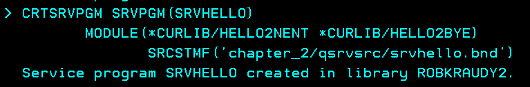
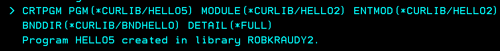

# Chapter two: Service Programs

Creating programs from modules the way we did in chapter one can be tedious, but not only that, if the logic of a module is changed, the module and the program need to be recompiled. Imagine the case where you have a module on 50 different programs.

For that reason, an object called **Service Program** was created. Instead of having a copy of the compiled module on every program, a copy of the module is created on this special program called **Service Program**. 

In this way, programs that need to call a procedure from a module simply store a reference to the service program where they will search for the procedure symbol at compilation time and load the procedure dynamically at execution time. 

This avoids the problem of recompiling every program; only the module and the service program need to be recompiled.

## Content
- []()
- []()
- []()

## Modules to Service Program

Lets create a service program from the two hello modules of [Chapter 1](../chapter_1/chapter_1.md)

- [Hello World module](./ch1_qrpglesrc/hello2.nomain.module.rpgle#L7)
- [Bye World module](./ch1_qrpglesrc/bye.nomain.module.rpgle#L7)

```js
CRTSRVPGM SRVPGM(SRVHELLO)                            
MODULE(*CURLIB/HELLO2NENT *CURLIB/HELLO2BYE)
EXPORT(*ALL)                                
```
<div style="text-align: center;">
  
</div>

Pay close attention to the `EXPORT(*ALL) ` parameter. This means that all the module's procedures of the service program are to be accesed from outside, something you usually don't want out in the wild. For that reason exists the **binding language** where you can specify which procedures or symbols are to be exposed and what should not, similar to an API; in fact, a service programs can be used to expose a JSON REST API, but that's a topic for another time.

Do **OP 5** + `enter` + `enter` on the created **Service Program** 
<div style="text-align: center;">
  
</div>

There you have the compiled programs inside the service program. Again, hit `enter` + `enter`

<div style="text-align: center;">
  
</div>

That is the list of the export symbols by the service programs, not by each individual module like before.

Now, lets create the executable program with the service program instead of the two modules

```js
CRTPGM PGM(*CURLIB/HELLO4)        
MODULE(*CURLIB/HELLO2) ENTMOD(*CURLIB/HELLO2)     
BNDSRVPGM((*LIBL/SRVHELLO)) DETAIL(*FULL)              
```

<div style="text-align: center;">
  
</div>

Call the program `CALL PGM(*CURLIB/HELLO4)`. You should see the same *Hello World!* and *Bye World* as before.

Do **OP 5** on `HELLO4` + `enter` + `enter` + `enter` and there we have the service programs inside the program.

<div style="text-align: center;">
  
</div>

Look at the service program **signature**, that will be important later. 

Now, delete the service program `SRVHELLO`, end your session with `SIGNOFF ENDCNN(*YES)` and log in again. 

This is needed because if `HELLO4` was called previously, it **activated** the `SRVHELLO` and even if you delete the service program, it may still be stored in the job's memory space, so it may still execute normally.

Call the `HELLO4` program again `CALL PGM(*CURLIB/HELLO4)`. 

<div style="text-align: center;">
  
</div>

A service program not found error occurs. Why? A link to the service program is created in the program at compilation time to be resolved at **activation** for the program to dynamically execute the procedure, which is what we want. This way avoids having to burn the modules inside the program like in the old times.

Create the service program again like before.
```js
CRTSRVPGM SRVPGM(SRVHELLO)                            
MODULE(*CURLIB/HELLO2NENT *CURLIB/HELLO2BYE)
EXPORT(*ALL)                                
```

This is the base of modern ILE developments.


## Service Program from Binding Language

The previous way expose all the modules procedures to be accesed from outside, usually you don't want that since there are procedures that are only need by the module. This is something we hinted alread with the `EXPORT(*ALL)` parameter.

To define which procedures are to be accesed from outside the service program we will use the **binding language**. It is like a list of procedures names to be exposed, nothing fancy. It can be created manually but there is also a command that can help us.

```js
RTVBNDSRC MODULE(*CURLIB/HELLO2NENT *CURLIB/HELLO2BYE)
SRCFILE(*CURLIB/QSRVSRC)                    
```
<div style="text-align: center;">
  
</div>

Go to `QSRVSRC` source PF `WRKMBRPDM FILE(*CURLIB/QSRVSRC) MBR(*ALL)` to see the list of symbols.
<div style="text-align: center;">
  
</div>

Create the service program from the binding language
```js
CRTSRVPGM SRVPGM(SRVHELLO)                            
MODULE(*CURLIB/HELLO2NENT *CURLIB/HELLO2BYE)
SRCSTMF('chapter_2/qsrvsrc/srvhello.bnd')    
```
<div style="text-align: center;">
  
</div>

Create the program the same way as before.
```js
CRTPGM PGM(*CURLIB/HELLO4)        
MODULE(*CURLIB/HELLO2) ENTMOD(*CURLIB/HELLO2)     
BNDSRVPGM((*LIBL/SRVHELLO)) DETAIL(*FULL)              
```

A modern program can use many service programs; for that, there is an object called **Binding Directory** 

## Service Programs with Binding Directories.

A **Binding Directory** is an object which basically stores a list of linkers or pointers to service programs for the compiler to look them up when creating the program.

Create the binding directory
```js
CRTBNDDIR BNDDIR(BNDHELLO)
```
<div style="text-align: center;">
  
</div>

Add the service program to it
```js
ADDBNDDIRE BNDDIR(*CURLIB/BNDHELLO)
OBJ((*LIBL/SRVHELLO))
```
<div style="text-align: center;">
  
</div>

Compiling the program is similar; instead of specifying the service program, just indicate the binding directory.
```js
CRTPGM PGM(*CURLIB/HELLO5) MODULE(*CURLIB/HELLO2)  
ENTMOD(*CURLIB/HELLO2) BNDDIR(*CURLIB/BNDHELLO)
DETAIL(*FULL)           
```
<div style="text-align: center;">
  
</div>

Call it normally `CALL PGM(*CURLIB/HELLO5)`

## Program from Binding Directories.

This is the modern way of creating programs: Create the modules, extract the exported list of symbols with `rtvbndsrc` or manually, use it to crate the service program and add it to a binding directory. Then create the program that uses the service program referencing only the binding directory.

This is the [Modern RPG program](./qrpglesrc/hello5.pgm.rpgle). Note the [Binding Directory](./qrpglesrc/hello5.pgm.rpgle#L5).

For compilation just do `Ctrl + e` from VsCode or deploy it with `Ctrl + Shift + e` and compile with this command

```js
CRTBNDRPG PGM(*CURLIB/hello5) 
SRCSTMF('chapter_2/qrpglesrc/hello5.pgm.rpgle') 
OPTION(*EVENTF) DBGVIEW(*SOURCE) TGTCCSID(*JOB)
```
<div style="text-align: center;">
  
</div>

This is the modern compilation way and is what we'll be using from now on.