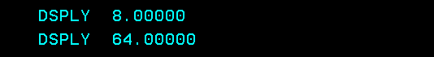

# Chapter three: Programming

Modern RPG programming is procedure-driven. Each procedure can be seen as a context of execution with its own containerized logic and local variables along with an interface that defines what values it receives and returns. 

## Content

- []()
- []()
- []()
- []()
- []()

## Compile objects

Prepare compilation context
```js
CHGCURDIR DIR('/home/YourUser/builds/rpg_language')
```
```js
chgcurlib YourLib
```

Do `Ctrl + Shift + e` to upload source code from the project if you haven't.

Create math Module
```js
CRTRPGMOD MODULE(*CURLIB/MATH) 
SRCSTMF('chapter_3/qrpglesrc/math.module.rpgle')
OPTION(*EVENTF) DBGVIEW(*SOURCE) TGTCCSID(*JOB)
```

Create Math Service Program
```js
CRTSRVPGM SRVPGM(SRVMATH)                            
MODULE(*CURLIB/MATH)
SRCSTMF('chapter_3/qsrvsrc/math.bnd')    
```

Create Bind dir
```js
CRTBNDDIR BNDDIR(BNDMATH)
```

Add service program to binding directory
```js
ADDBNDDIRE BNDDIR(*CURLIB/BNDMATH)
OBJ((*LIBL/SRVMATH))
```

## Procedures

A procedure or function is similar to a mathematical function, hence the same name. It takes some input, `x`, applies some series of operations on the data `f(x)` and produces an output `y`: `y = f(x)`.

A program can be viewed as a series of procedures or functions that perform a series of operations on some data. Execution is not always linear, and some decisions need to be made at certain points based on the data, which resembles an automata.

Modern machines are mostly based on the Von Neumann architecture, where data and operations are both stored in memory. This is why the program instructions and data are both loaded from memory to registers to be executed. Instructions and data are not so distinct.

Lests do a simple [square](./qrpglesrc/square.pgm.rpgle#13) example : `y = x^2`

```js
CRTBNDRPG PGM(*CURLIB/square) 
SRCSTMF('chapter_3/qrpglesrc/square.pgm.rpgle') 
OPTION(*EVENTF) DBGVIEW(*SOURCE) TGTCCSID(*JOB)
```

Just call it `CALL PGM(*curlib/square) PARM((8))`
<div style="text-align: center;">
  
</div>


## Variables


| Opcode | Declaration for |
|----------|----------|
| DCL-F   | A file (replacing F spec)     |
| DCL-S   | A stand-alone field     |
| DCL-DS    | A data structure     |
| DCL-C    | A named constant     |
| DCL-PR  | A prototype     |
| DCL-PI    | A procedure interface     |
| DCL-PROC    | A procedure (replacing the P spec)     |

```js
Dcl-S CustName Char(10);
Dcl-S AcctBalance Packed(5:2);
Dcl-S Count Packed(3);
Dcl-S AnotherCount Int(3);
Dcl-S OrderDate Date(*Iso);
```

## Arrays


## Data Structures

```js
Dcl-DS Address;
  Street Char(30);
  City Char(20);
  State Char(2);
  ZipCode Zoned(9);
  Zip Zoned(5) Overlay(ZipCode);
  ZipPlus Zoned(4) Overlay(ZipCode:5);
End-DS Address;
```

## Control logic


# Notes on files

**Disk** is the default type for the new **Device** keyword as is “externally described”

```js
Dcl-F CustMast Device(Disk);
```
More examples
```js
Device(Printer) Usage(*Output)
Device(WorkStn) USAGE(*Input: *Output).
```

Read logic

```js
Dcl-F DateFile Usage(*Update);

Read DateFile;

DoU %EOF(DateFile);
  Count+= 1;
  Test(DE) *CYMD CYMD;
  If %Error;
  If newPage;
  pageNum += 1;
  Write Heading;
  newPage = *Off;
  EndIf;

  Write Detail;
  Else;
  // Update record with additional data
  fullDate = %Date(CYMD: *CYMD);
  dayName = NameOfDay(fullDate);
  dayNumber = DayOfWeek(fullDate);
  Update DateRec;

  EndIf;
  Read DateFile;
 EndDo; 
```

This use: record level access (RLA). SQL use the modern concept of data sets.
